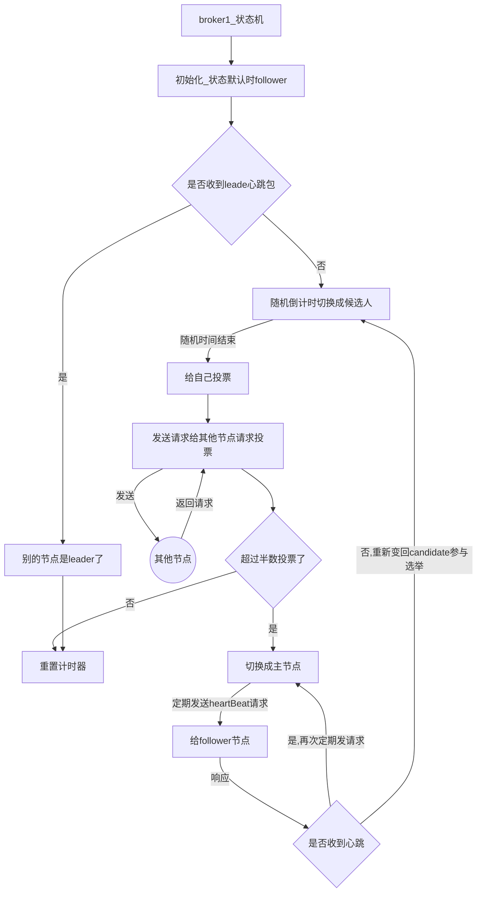

# 主从
#### pull/push
```
pull 从节点建立2个线程 （请求主节点线程，接受主节点响应线程）
请求线程发送请求 （参数：当前最大偏移量）主节点收到请求后把偏移量之后的数据都拉出来 发送回去 从节点的响应线程接受请求 写数据到磁盘(pageCache->磁盘)

push 主节点写数据时 push给从节点 2/3 成功(pageCache成功就算成功)就算成功
```
#### 消费消息
```
一般都走主节点读，当主节点读压力大时，会返回给客户端从节点id,去从节点消费，从节点消费状况很好时，最终又会回到主节点进行消费

一般mq 都倾向于 主节点做读写，原因：消费进度好维护
      如果读请求被分发到从节点，从节点也会产生消费进度元数据 每隔10s 会同步数据到主节点

```

#### 选举leader过程




