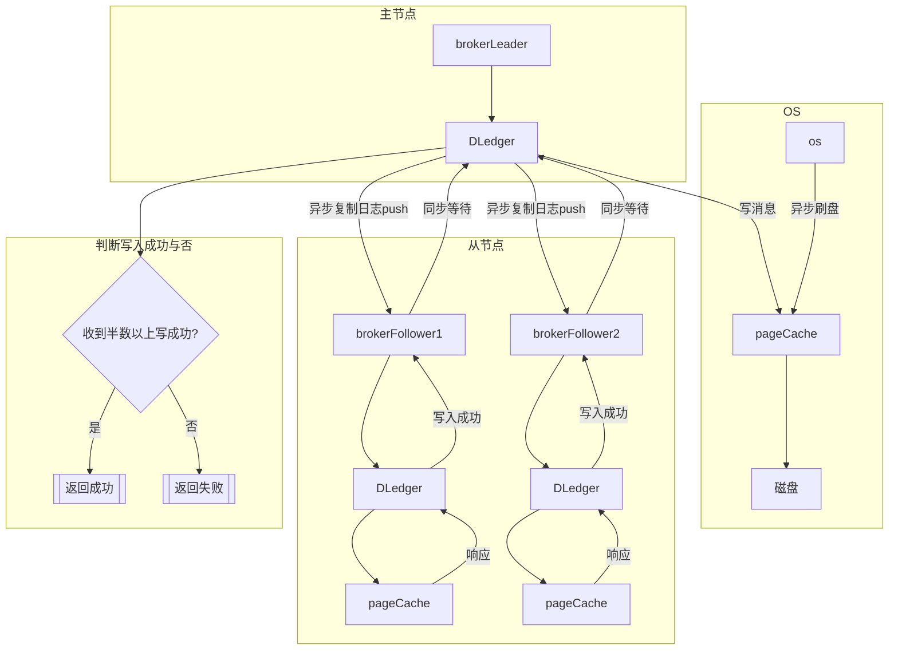

#基于DLegder push 异步

```mermaid
graph TD;
pc[pageCache]
os
dl[DLedger]
bf1[brokerFollower1]
bf2[brokerFollower2]
bL[brokerLeader]
dl--写消息-->pc
subgraph OS
os--异步刷盘-->pc-->cp[磁盘]
end

subgraph 主节点
bL --> dl
end
subgraph 从节点
dl--异步复制日志push-->bf1-->dL1[DLedger]-->pc1[pageCache]--响应-->dL1--写入成功-->bf1
bf1--同步等待-->dl
dl--异步复制日志push-->bf2-->dL2[DLedger]-->pc2[pageCache]--响应-->dL2--写入成功-->bf2
bf2--同步等待-->dl
end

subgraph 判断写入成功与否
dl-->su{收到半数以上写成功?}
su--是-->y[[返回成功]]
su--否-->n[[返回失败]]
end
```
