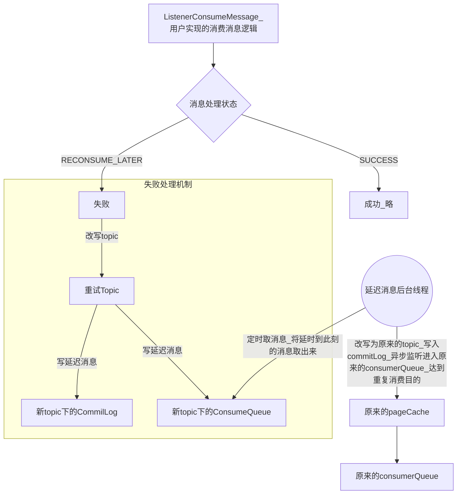

#### 消费消息

```
谁来负责 queue->consumer分配:consumer自己分配，consumer获取到queue后根据相同的算法来选择从哪个队列里消费

topic里的queue信息从哪里获取:从nameserver或broker中获取

如何知道以consumer  group里由多少个consumer :
	consumer启动会向每个broker注册自己，所以broker知道每个consumerGroup里都有哪些 broker,
	同时consumer也能通过broker知道自己所处的group都有哪些其他的consumer


push/pull：底层都是pull，都是consumer去发送请求拉取消息

shortPulling(短轮询):没拉到消息挂起1s后，再没拉到消息返回客户端没拉到消息
longPulling（长轮询）:push模式【挂起+每5s检查（后台线程），一直到15s没拉到消息，才超时返回】
					  pull模式 挂起超时为20s


```

#### push/pull区别

```

源代码版本是3.2.6。在rocketmq里，consumer被分为2类：MQPullConsumer和MQPushConsumer，其实本质都是拉模式（pull），即consumer轮询从broker拉取消息。

区别是：

push方式里，consumer把轮询过程封装了，并注册MessageListener监听器，取到消息后，唤醒MessageListener的consumeMessage()来消费，对用户而言，感觉消息是被推送过来的。

pull方式里，取消息的过程需要用户自己写，首先通过打算消费的Topic拿到MessageQueue的集合，遍历MessageQueue集合，然后针对每个MessageQueue批量取消息，一次取完后，记录该队列下一次要取的开始offset，直到取完了，再换另一个MessageQueue。
```

#### consumer的队列映射与并发消费
```
消费者
	-->拉取消息线程(每个消费者唯一一个)拉取消息(批量)
	-->放入ProcessQueue(每个ProcessQueue与ConsumeQueue对应)
	-->拉取完消息，提交任务（告诉多线程组取处理消息）
	-->线程池并发处理ProcessorQueue们，调用我们自己实现的消息消费逻辑(Listener.consumerMessage)
	-->消息处理完会返回状态(SUCCESS/RECONSUME_LATER)(如果是success会将消息从processQueue中删除)

```

* 图解


#### 消费进度维护
```
1.消费成功后删除 consumerGroup会更新内存中的消费进度
2.后台线程 会 同步consumerGroup中的消费进度到broker【先内存再磁盘】
  消费端的多线程组 消费完消息 会在本地内存中记录消费进度，这时会有一个后台线程会把消费进度发到broker内存（会有个后台线程将它同步到磁盘）
```


#### 重复消费场景
```
重复消费场景
	已经成功处理的消息,消费进度在内存中还没来得及刷盘,consumerGroup/broker所在机器挂了，消费进度不存在了 ，重新拉取消息拉到了消费过的消息
	没有及时将offset写入到broker（成功处理消息，返回给broker遇到网络问题，发不过去，再次消费消息，又把消费过的消息拉过来了）
```

#### 失败消息处理机制
```
消息处理失败时的延时消费机制
	改写失败消息的 Topic eg:RETRY_Topic_原消息topic（当然也有队列，有些叫重试队列）
	写入重试topic下 （CommitLog,ConsumerQueue）
	后台线程定时扫描ConsumeQueue 取出对应消息 改写topic为原topic 写入commitLog 异步监听conmmitLog最终到达原consumeQueue 
	原consumQueue中的消息被拉取消费，从而达到重复消费的目的
	
```

图解



